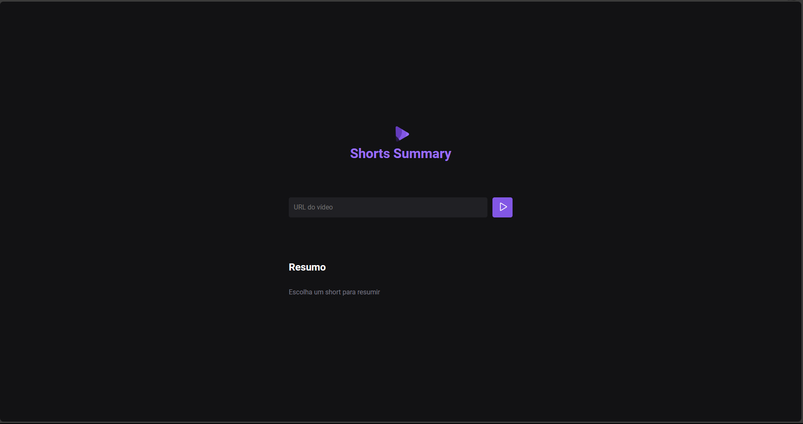

# NLW AI | Shorts Summary | Foundations Track

**Projeto: Shorts Summary**

Shorts Summary é uma aplicação web para criar resumo de vídeos shorts do Youtube utilizando Inteligência Artificial para transcrever o conteúdo do vídeo e realizar o resumo do conteúdo. Esse projeto é desenvolvido na trilha Foundations na edição NLW IA.

**Ideias para aprimorar**
- [ ] Vídeos do TikTok
- [ ] Testar outros modelos de AI
- [ ] Vídeos longos do YouTube
